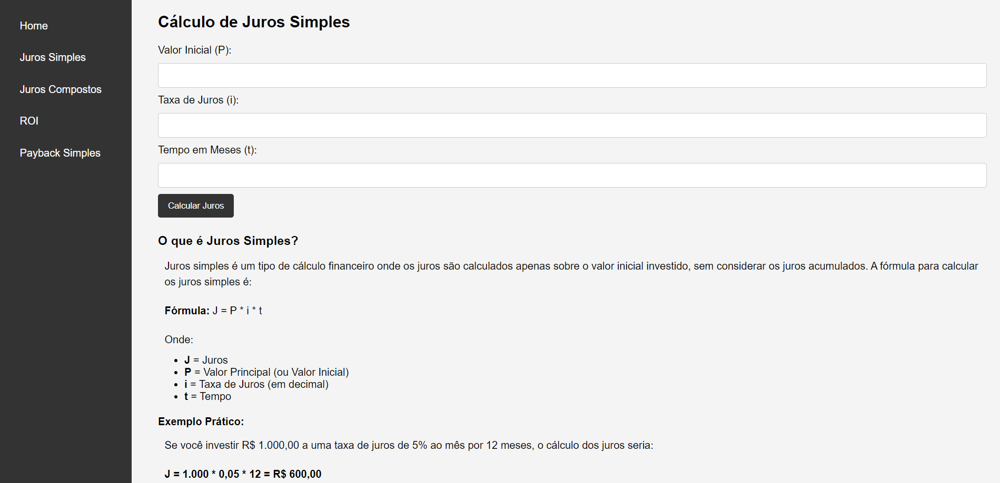

# 💰 CalcFácil Financeira

## Descrição
**CalcFácil Financeira** é uma aplicação web simples que permite realizar cálculos financeiros como **Juros Simples**, **Juros Compostos**, **ROI** e **Payback Simples**. A página foi desenvolvida utilizando **HTML**, **CSS** e **JavaScript**, com foco em facilitar a análise de operações financeiras básicas. O layout inclui uma barra lateral de navegação para acessar rapidamente as diferentes operações.



## 🛠️ Tecnologias Usadas
- **HTML**: Para estruturar o conteúdo da página.
- **CSS**: Para padronizar e estilizar a interface.
- **JavaScript**: Para realizar os cálculos financeiros e manipular os dados inseridos pelos usuários.


## 🚀 Funcionalidades
- **Juros Simples**: Calcula o valor dos juros em uma aplicação financeira de forma simples.
- **Juros Compostos**: Realiza o cálculo de juros compostos sobre um valor inicial.
- **ROI (Retorno sobre Investimento)**: Calcula a porcentagem de retorno com base no lucro e no investimento inicial.
- **Payback Simples**: Calcula o tempo necessário para recuperar o investimento inicial.

## 📂 Estrutura do Projeto

- **main.html**: Página principal da aplicação com a navegação entre as operações financeiras.
- **juros.html**: Página para cálculo de Juros Simples.
- **juroscompostos.html**: Página para cálculo de Juros Compostos.
- **roi.html**: Página para cálculo do ROI (Retorno sobre Investimento).
- **paybacksimples.html**: Página para cálculo de Payback Simples.
- **style.css**: Arquivo de estilo, aplicando a padronização visual para todas as páginas.
- **juros.js**: Lógica de cálculo de Juros Simples.
- **juroscompostos.js**: Lógica de cálculo de Juros Compostos.
- **roi.js**: Lógica de cálculo de ROI.
- **payback.js**: Lógica de cálculo de Payback Simples.

## 📖 Como Usar

1. Clone o repositório para o seu ambiente local:
   ```bash
   git clone https://github.com/DanilloSouza03/CalcFacil-Financeira.git
2. Abra o arquivo `index.html` no navegador para acessar a página principal.
3. Selecione a operação financeira desejada na barra lateral e insira os valores necessários para realizar os cálculos.   

<hr>
<p align="center">
👨‍💻 Desenvolvido por @dev.danillo
</p>